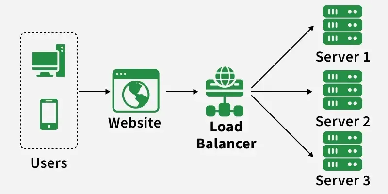
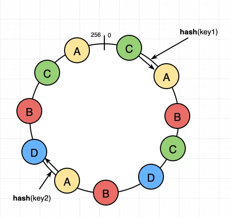

# Load Balancing
Load balancing is an impportant concept when we talk about Horizontal Scaling. We can add more servers to our system to handle increasing load. But how do you distribute the load over these servers?

A Load Balancer is a solution that is a traffic proxy who distributes network and application traffic across endpoints on a number of servers. Load balancers are used to distribute capacity during Peak Hours and increase reliability of the applications by reducing burden on individual servers.

   

### Advantages of using a load balancer include:
- **Application Availability** - One node goes down, rest will distribute its traffic while it recovers.
- **Application Scalability** - Add more machines to handle more traffic. Load balancer will take care of traffic distribution.
- **Application Security** - Minimize attack surface, make it more difficult to exhaust resources and saturate linkis.
- **Application Performance** - More computation power, less traffic to handle. System stays healthy and performant.

### Load Balancing Algorithms:

- **Round Robin** - This algorithm sends traffic to a list of servers **in rotation** usign DNS.  *(Note: DNS load balancing can also be a dynamic solution.)*
- **Threshold** - Distributes tasks based on a threshold value that is set by the administrator.
- **Least Connections** - New incoming requests are sent to the server with the **fewest current connections** to clients.
- **Least Time** - A request is sent to the server selected by a formula that combines "Fastest response time" and "fewest active connections".
- **URL hash** - This algorithm generates a hash value based on the URL of request. Requests are forwareded to servers based on this hash, while load balancer also caches the hashed value. Subsequent requests uses the cache hit result and forwarded to same server. 
- **Source IP hash** - Instead of URL, LB combines the client's source and destination IP addresses to generate unique hash key to tie client to a particular server. As the key can be regenerated if the session disconnects, this allows reconnection requests to get redirected to the same server used previously. Helps create **sticky sessions**.
- **Consistent Hashing** - Here we map both requests are servers on a ring structure (mapping each server to multiple points in ring). When a request arrives, we find its hash value on the the ring. Then it is dynamically routed clockwise the nearest server available.

# Consistent Hashing

Let's say we have `M servers` to distribute our traffic. We use a hash function `hash()` to get a hash value of a request which will always be the same. Then we will mod `%` this value with `M` to get the serverIndex where this request should be redoirected. Provided that the requests are uniform, this will always distribute the requests over servers uniformly. For example,

```py
hash("request1") -> 12354 % M -> 0
hash("request2") -> 31798 % M -> 1
hash("request3") -> 96788 % M -> 2
...
hash("requestN") -> 78536 % M -> M - 1
```

This works well as long as our server pool size is fixed. However if we're to add new servers or an existing server goes down, problems arise. Consider we added a server, pool size becomes `m + 1`. Using same hash function, we get same hash value for a key. But the serverIndex changes because we now mod this value with `m + 1` instead.

```py
hash("request1") -> 12354 % M + 1 -> 2 (changed)
hash("request2") -> 31798 % M + 1 -> 1
hash("request3") -> 96788 % M + 1 -> 4 (changed)
...
hash("requestN") -> 78536 % M + 1 -> M - 3 (changed)
```

This leads to most of keys getting redistributed, rendering our cache useless, as the cached results are stored in entirely different servers. This causes a storm of Cache misses. To resolve this, we use **Consistent Hashing**

> Consistent hashing is a special kind of hashing such that when a hash table is re-sized and consistent hashing is used, only k/n keys need to be remapped on average, where k is the number of keys, and n is the number of slots.

- **Hash Ring** - Concept of hash ring is simple, join both ends of a hash table to get a ring structure. 

- **Hash Servers** - Using the same hash function `hash()`, we map servers based on serverIP or name onto the ring.

- **Hash Keys** - We use a different function to hahs request keys and their is no modulo function involved. These keys are mapped onto the ring and routed to nearest available server, traversing clockwise. *Note: The space between two adjacent servers on the ring is called Partition*

- **Adding/Removing a server** - This will require redistribution of only a fraction of keys. But there are still two probems:
    - It is impossible to keep same size of partition on ring for all servers. 
    - It is possible to have a non-uniform key distribution on the ring.

To resolve this issue, we create **virtual nodes**. Essentially we use multiple hash functions to map each server on the hash ring multiple times. This makes the partition and distribution of keys more balanced.

   
