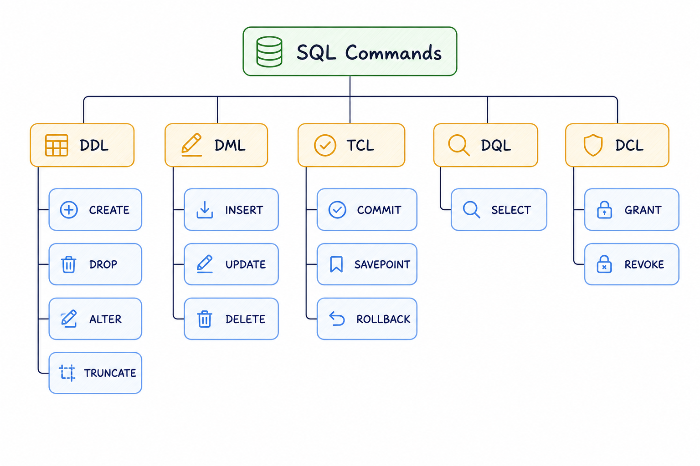

# SQL (Structured Query Language)
SQL, or Structured Query Language, is a language designed to allow both technical and non-technical users to query, manipulate, and transform data from a relational database. And due to its simplicity, SQL databases provide safe and scalable storage for millions of websites and mobile applications.

## SQL Database Hierarchy
1. In context of SQL, the top level is **Database Server**, also called the **instance**.
2. Within an instance, there can be multiple **databases**, each containing data based on some broad categorization.
3. A database is then broken down into **tables**. The actual data lives here.
4. Inside the table, data is organised by **columns** and **rows** and housed within **fields**, almost exactly like an Excel spreadsheet.

## SQL Data Types
SQL data types can be broadly divided into the following categories:
- **Numeric** data types such as `INT, TINYINT, BIGINT, FLOAT, REAL`, etc.
- **Date and Time** data types such as `DATE, TIME, DATETIME`, etc.
- **Character and String** data types such as `CHAR, VARCHAR, TEXT`, etc.
- **Unicode character string** data types such as `NCHAR, NVARCHAR, NTEXT`, etc.
- **Binary** data types such as `BINARY, VARBINARY`, etc.
- **Miscellaneous** data types such as `CLOB, BLOB, XML, CURSOR, TABLE`, etc.

**Vendor Differences to note!**
- Not all database vendors support the same set of data types.
- Many vendors introduce their own specialized data types that are not part of the ANSI SQL standard.
- The maximum size for a given data type, such as `VARCHAR`, can also vary between database systems.

## SQL Operators
SQL operators are symbols or keywords used to perform operations on data in SQL queries.
- Perform operations like calculations, comparisons, and logical checks.
- Enable filtering, calculating, and updating data in databases.
- Essential for query optimization and accurate data management.

| Type | Use | Operators | Example |
|------|-----|-----------|---------|
| **Arithmetic** | Math on numeric values | `+`, `-`, `*`, `/`, `%` | `SELECT salary * 1.10 AS raised_salary` |
| **Comparison** | Compare two values | `=`, `<>` or `!=`, `>`, `<`, `>=`, `<=` | `WHERE marks >= 70` |
| **Logical** | Combine or negate conditions | `AND`, `OR`, `NOT` | `WHERE age > 18 AND country = 'IN'` |
| **Bitwise** | Operate on bits of integer values | `&`, `\|`, `^`, `~` | `WHERE permissions & 2 = 2` |
| **Compound** | Modify a value and assign in one step | `+=`, `-=`, `*=`, `/=`, `%=` | `SET salary += 5000` |
| **Special** | Range, membership, pattern, and existence checks | `BETWEEN`, `IN`, `LIKE`, `IS NULL`, `EXISTS` | `WHERE name LIKE 'N%'` |

## SQL Commands

SQL commands are grouped into five categories based on what they operate on — structure, data, access, or transactions.

   

### DDL — Data Definition Language

Deals with the **structure** of the database. Used for creating, modifying, or deleting database objects like tables and schemas. Changes are auto-committed and generally irreversible.

| Command | What it does | Example |
|---------|-------------|---------|
| `CREATE` | Creates a new table, index, or view | `CREATE TABLE users (id INT, name VARCHAR(50));` |
| `ALTER` | Modifies an existing table structure | `ALTER TABLE users ADD COLUMN email VARCHAR(100);` |
| `DROP` | Deletes a table or object entirely | `DROP TABLE users;` |
| `TRUNCATE` | Removes all rows but keeps the table structure | `TRUNCATE TABLE users;` |
| `RENAME` | Renames an existing object | `RENAME TABLE users TO members;` |

---

### DQL — Data Query Language

Used purely to **retrieve data**. `SELECT` is the only command; everything else (`WHERE`, `GROUP BY`, `ORDER BY`, etc.) are clauses that shape the result. No data is modified.

| Command | What it does | Example |
|---------|-------------|---------|
| `SELECT` | Fetches rows from one or more tables | `SELECT name, email FROM users WHERE active = 1;` |

Key clauses: `FROM`, `WHERE`, `GROUP BY`, `HAVING`, `ORDER BY`, `DISTINCT`, `LIMIT`

---

### DML — Data Manipulation Language

Deals with the **data inside tables** — adding, changing, or removing rows. Unlike DDL, DML changes can be rolled back within a transaction.

| Command | What it does | Example |
|---------|-------------|---------|
| `INSERT` | Adds new rows to a table | `INSERT INTO users (name, email) VALUES ('Vasu', 'v@utrade.com');` |
| `UPDATE` | Modifies existing rows | `UPDATE users SET email = 'new@utrade.com' WHERE id = 1;` |
| `DELETE` | Removes specific rows | `DELETE FROM users WHERE active = 0;` |

---

### DCL — Data Control Language

Manages **access and permissions** on database objects. Used by admins to control who can read, write, or modify data.

| Command | What it does | Example |
|---------|-------------|---------|
| `GRANT` | Gives a user permission on an object | `GRANT SELECT, UPDATE ON users TO analyst;` |
| `REVOKE` | Removes a previously granted permission | `REVOKE UPDATE ON users FROM analyst;` |

---

### TCL — Transaction Control Language

Controls **transactions** — groups of DML operations that should succeed or fail together. Critical for maintaining data integrity.

| Command | What it does | Example |
|---------|-------------|---------|
| `BEGIN` | Starts a new transaction | `BEGIN TRANSACTION;` |
| `COMMIT` | Saves all changes in the transaction permanently | `COMMIT;` |
| `ROLLBACK` | Undoes all changes since the last commit | `ROLLBACK;` |
| `SAVEPOINT` | Sets a named checkpoint within a transaction | `SAVEPOINT before_update;` |

```sql
-- Example: safe update with rollback
BEGIN TRANSACTION;
  UPDATE accounts SET balance = balance - 500 WHERE id = 1;
  UPDATE accounts SET balance = balance + 500 WHERE id = 2;
COMMIT;
-- If anything fails, ROLLBACK; restores both rows
```

## SQL Comments
Written inside SQL code to help developers understand what the code is doing

**Single-line comments**
```sql 
SELECT * FROM Students;  -- This gets all student records
```

**Multi-line comments**
```sql
SELECT * 
FROM orders 
WHERE YEAR(order_date) = 2022;  
/* This query retrieves all orders
   that were placed in the year 2022 */
```

**In-line comments**
```sql
SELECT 
    customer_name,  -- Name of the customer
    order_date      -- Date when the order was placed
FROM orders;
```
