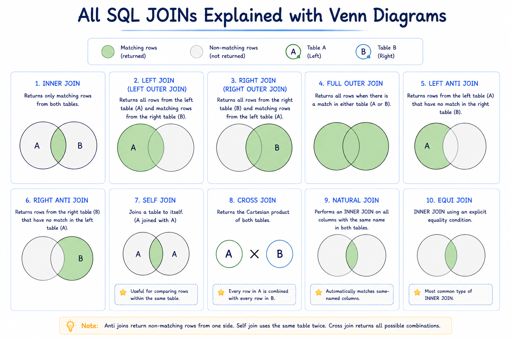

# SQL II (Querying & Data Retrieval)
So far we have covered the foundations of SQL — what it is, how databases are structured, the core data types, operators, and the five command categories (DDL, DQL, DML, DCL, TCL). Now we move on to actually writing queries — selecting, filtering, sorting, joining, and aggregating data from real tables.

Basic SQL statement structures are verbs, subjects, and conditions. Most SQL statements follow a pattern:

- **Verb (Action)**: is the action you want the database to do, such as `SELECT`, `INSERT`, `UPDATE`, and `DELETE`.
- **Subject (Target)**: is the database object you work with, such as a table.
- **Condition (Filter)**: choose which data you’re interested in.

SQL is **case-insensitive** hence keywords can be written either in uppercase, lowecase camelcase, etc. By convention, we write **SQL keywords in uppercase** and **identifiers in lowercase** such as table names. 


## Querying Data (`SELECT`)
- Use the `SELECT` statement with a comma-separated list of columns from the table you want to retrieve data.
- Use the `SELECT *` to retrieve data from all columns of a table.
- Provide the table name in the `FROM` clause.
- Give a temporary alias to a column name in `SELECT` clause using `AS` keyword, though it is optional but offer better readability.

```sql
SELECT select_list
FROM table_name;
```


## Sorting (`ORDER BY`)
- Use the `ORDER BY` clause to sort rows in a result set.
- Use the `ASC` option to sort rows in ascending order and `DESC` option to sort rows in descending order.
- Use `NULLS FIRST` to place NULLs before and `NULLS LAST` to place NULLs after other non-NULL values.

```sql
SELECT select_list
FROM table_name
ORDER BY sort_expression [ASC | DESC];
```


## Limiting Rows (`DISTINCT, LIMIT, FETCH`)
- To select the distinct values from a column of a table, you use the `DISTINCT` operator in the `SELECT` clause.

```sql
SELECT DISTINCT column_1, column_2
FROM table_name;
```
> Note that the DISTINCT only select distinct values from a table. It doesn’t delete duplicate rows in the table.

- Use the `LIMIT` clause to limit the number of rows returned by a query.
- Use the `OFFSET` clause to skip some rows before returning the number of rows specified by the `LIMIT` clause.

```sql
SELECT column_list
FROM table_name
ORDER BY column_list
LIMIT row_count
OFFSET row_to_skip;
```

- Use the `FETCH` clause to limit the number of rows returned by a query.
- Use the `OFFSET` clause to skip `N` rows before starting to return the number of rows specified in the `FETCH` clause..

```sql
OFFSET rows_to_skip { ROW | ROWS }
FETCH { FIRST | NEXT } [ row_count ] { ROW | ROWS } ONLY
```


## Filtering (`WHERE` + all its operators)
- Use the `WHERE` clause to filter rows based on one or more conditions.
```sql
SELECT column1, column2, ...
FROM table_name
WHERE condition;
```
> Note that SQL has three-valued logic which are true, false, and NULL. It means that if a row causes the condition to evaluate to false or null, the query will not include that row in the result set.

We have already discussed SQL Operators previously so we'll skip that. You can refer to [SQL Operators](sql_i.md#sql-operators)


## Joins (`INNER, LEFT, RIGHT, FULL OUTER, CROSS, SELF`)




- Use `INNER JOIN` or simply `JOIN` clause to merge rows from two tables based on a condition.
- The inner join includes only the rows with matching values and does not includes unmatching rows in the result set.
- Unlike an `INNER JOIN` clause, the `LEFT JOIN` clause always includes all rows from the left table.
- the `RIGHT JOIN` clause always includes rows from the right table.
```sql
SELECT column1, column2
FROM table1
  {INNER | LEFT | RIGHT} JOIN table2 ON condition;
```

- A **self-join** is a join that compares the rows within the same table. 
- A self-join uses an inner join, left join, or right join that joins a table to itself. 
- It uses **table aliases** to treat the same table as separate tables within the same query.
```sql
SELECT select_list
FROM table1 t1
  INNER JOIN table1 AS t2 
  ON t1.column1 = t2.column2;
```

- Use the `FULL OUTER JOIN` or `FULL JOIN` clause to merge rows from two tables by including rows from both tables whether or not the rows have matching rows from another table.
```sql
SELECT column1, column2
FROM table1
  FULL JOIN table2 
  ON table2.column2 = table1.column1;
```

- The `CROSS JOIN` clause merges every row from the first table (`table1`) with every row in the second table (`table2`). It returns a result set that includes **all possible combinations** of the rows in both tables.
- The result set of a `CROSS JOIN` is often called the **Cartesian product** of two tables.


## Grouping (`GROUP BY, HAVING`)

### `GROUP BY` clause
- The `GROUP BY` clause groups the rows into groups based on the values of one or more columns.
- Use an aggregate function with the `GROUP BY` clause to calculate the summarized value for each group such as `MIN`, `MAX`, `AVG`, `SUM` or `COUNT`.
```sql
SELECT column1, column2, aggregate_function (column3)
FROM table_name
GROUP BY column1, column2;
```

### `HAVING` clause
- The `GROUP BY` clause groups rows of a result set into groups. To specify a condition for filtering groups, you use a `HAVING` clause.
- If you use a `HAVING` clause without a GROUP BY clause, the `HAVING` clause behaves like a `WHERE` clause.
- The `HAVING` clause appears immediately after the `GROUP BY` clause whereas the `WHERE` clause is applied before the `GROUP BY` clause.
```sql
SELECT column1, column2, aggregate_function (column3)
FROM table1
GROUP BY column1, column2
HAVING group_condition;
```

## Set Operations (`UNION, INTERSECT, MINUS`)

### `UNION` operator
- Use the `UNION` operator to combine result sets from two queries into a single result set.
- The `UNION` operator removes duplicate rows from the final result set.
- Use the `UNION ALL` operator to retain the duplicate rows.
- Place the `ORDER BY` in the second query to sort the rows in the final result set.
```sql
SELECT column_1, column_2
FROM table_1
UNION
SELECT column_3, column_4
FROM table_2
```

### `INTERSECT` operator
- Use the `INTERSECT` operator to find common rows of two result sets.
- The `INTERSECT` operator removes duplicate rows from the final result set.
```sql
SELECT column_1, column_2
FROM table_1
INTERSECT
SELECT column_3, column_4
FROM table_2
```

### `MINUS` operator
- Use `MINUS` operator to find the difference between result sets of two queries.
```sql
SELECT column_1, column_2
FROM table_1
MINUS
SELECT column_3, column_4
FROM table_2
```

> **Note:** `MINUS` is Oracle syntax. Most other databases use `EXCEPT` instead (`PostgreSQL`, `SQL Server`, `SQLite`). They behave identically.

## Conditional Expressions & Functions

### `CASE` expression
The `CASE` expression allows you to add if-else logic to queries, making them more powerful. The `CASE` expression has two forms:
- Simple `CASE` expression.
- Searched `CASE` expression.

You can use the CASE expression in the clauses such as `SELECT`, `ORDER BY`, and `HAVING` of the `SELECT`, `DELETE`, and `UPDATE` statements.

```sql
-- syntax
CASE expression
  WHEN when_expression_1 THEN result_1
  WHEN when_expression_2 THEN result_2
  WHEN when_expression_3 THEN result_3
  ELSE else_result
END
```

### `COALESCE` function
In SQL, the `COALESCE()` function takes one or more arguments and returns the first non-NULL argument.

```sql
COALESCE(argument1, argument2,...); -- syntax
```

The `COALESCE` function uses short-circuit evaluation. It does not evaluate the remaining arguments after it encounters the first non-NULL arguments.

### `NULLIF` function
The `NULLIF` function compares two values and returns NULL if they are equal.

```sql
NULLIF(value1,value2); -- syntax
```
It returns value1 if the values are not equal.


## Subqueries (regular, correlated, `EXISTS, ALL, ANY`)

### Regular Subquery
- A subquery is a query nested in an outer query.
- Embed an appropriate subquery in the `SELECT`, `FROM`, `WHERE`, and `INNER JOIN` clauses of a query.
- The subquery in the `SELECT` clause can return a single value.
- The subquery in the `FROM` or `INNER JOIN` clauses can return a result set.
- The subquery in the `WHERE` clause can return a single value.

### Correlated Subquery
A *regular query* executes once and provides the result to an outer query. However, a *correlated subquery* executes **repeatedly** – once for each row processed by the outer query.

A correlated subquery has two main characteristics:
- Referencing a column from the outer query.
- Executing once for each row of the outer query.

Typically, you use a correlated subquery in `WHERE`, `SELECT`, or `HAVING` clauses.

### `ALL` operator
The `ALL` operator is used with a comparison operator such as `>, >=, <, <=, <>, =` to compare a value with all values returned by a *subquery*.
```sql
value ALL comparison_operator (subquery) -- basic syntax
```

The condition is **true** when:
- The subquery returns no row.
- Or the comparison of the value with all the values returned by the subquery are true.

### `ANY` operator
The `ANY` the operator is used with a comparison operator such as `>, >=, <, <=, =, <>`  to compare a value with a list of values returned by a subquery.
```sql
value comparison_operator ANY (subquery) -- basic syntax
```
The `ANY` operator returns **true** if the comparison is true for at least one value in the set. It returns **false** if the subquery returns no rows.

### `EXISTS` operator
- The `EXISTS` operator allows you to check if a subquery returns any row.
- The `EXISTS` operator returns **true** if the subquery returns at least one row or false otherwise.

```sql 
-- syntax
SELECT column1, column2
FROM table_name
WHERE
  EXISTS (subquery);
```