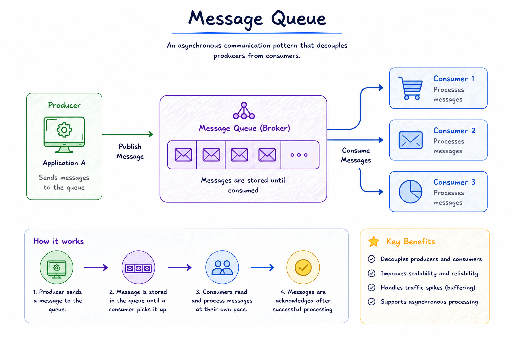

# Message Queue

Imagine that you have an image uploding service which does a set of tasks synchronously.
 - resize (~2s)
 - filter (~2s)
 - content moderation (~2s)

All of these add upto ~6s of wait time before response. And that is not all, If any of the steps fail, the entire request fails and all steps need to be repeated over. And what if we get a burst of requests? The system will choke. To avoid this from happening, we use **message queues**.

> A message queue is a form of service-to-service communication that facilitates asynchronous communication. It asynchronously receives messages from producers and sends them to consumers.

   

Essentially, we decouple our service into a **"Producer"** (lightweight API Server) and **"Consumer"** (asynchronous workers) and a buffer between the two which is known as **"Message Queue"**.

- **Producer** - It is a Lightweight API Server that takes the request from client, enqueue a message in the message queue and send back a response to the client immediately and goes on to take care of other requests. And the response it send back to client immediately is not the final result but a sort of acknowledgement that tells the client, "Rest assured. We have received your request. We will notify you promptly as soon as the response arrives."
- **Consumer** - These are a worker or a group of workers, depending on the service being used, that listen to the messages to the queue, process them and send `ack` to the queue. Only after receiving the `ack` from the consumer, the queue will remove the message from the queue. Depending on the queue's configuration, messages can be consumed *in order*, *based on priority*, or even *in parallel*.
- **Meesage Queue** - The data structure that stores and persist the messages until they are consumed. It only removes the message after receiving `ack` from consumer. This helps in the case when a consumer fails and never sends the `ack`, another worker can pick that message and process it.

### Types of Message Queues

1. **Point-to-Point (P2P) Queue** - In this model, messages are sent from one producer to one consumer.
Used when a message needs to be processed by a single consumer, such as in task processing systems.
2. **Publish/Subscribe (Pub/Sub) Queue** - In this model, messages are published to a topic, and multiple consumers can subscribe to that topic to receive messages. Used for broadcasting messages to multiple consumers, such as in notification systems.
3. **Priority Queue** - Messages in the queue are assigned priorities, and higher-priority messages are processed before lower-priority ones.
4. **Dead Letter Queue** - A special type of queue where messages that cannot be processed (due to errors or retries) are sent. Useful for troubleshooting and handling failed messages.

### Advantages
Certain Advantages Message Queue provides:
- Decoupling
- Asynchronous Processing
- Load Balancing
- Fault Tolerance
- Scalability
- Throttling

### When to use Message Queues
1. **Microservice Architecture** - When microservices need to communicate with each other but direct communication creates tight coupling.
2. **Task Scheduling and Background Processing** - Certain tasks that are time-consuming and should not block main application flow can be offloaded to a message queue.
3. **Event-driven Architectures** - When some events needs to be propagated to multiple services but direct communication is inefficient.
4. **Load Leveling** - Throttling requests via message queue can handle sudden spikes in requests and prevent system from degraded performance or even failures.
5. **Reliable Communication** - Using persistent message queues to ensure that messages are not lost and can be retried if delivery fails.

Popular Message Queue Systems are: RabbitMQ, Apache Kafka, Amazon SQS, Redis Streams, Google Cloud Pub/Sub, etc.