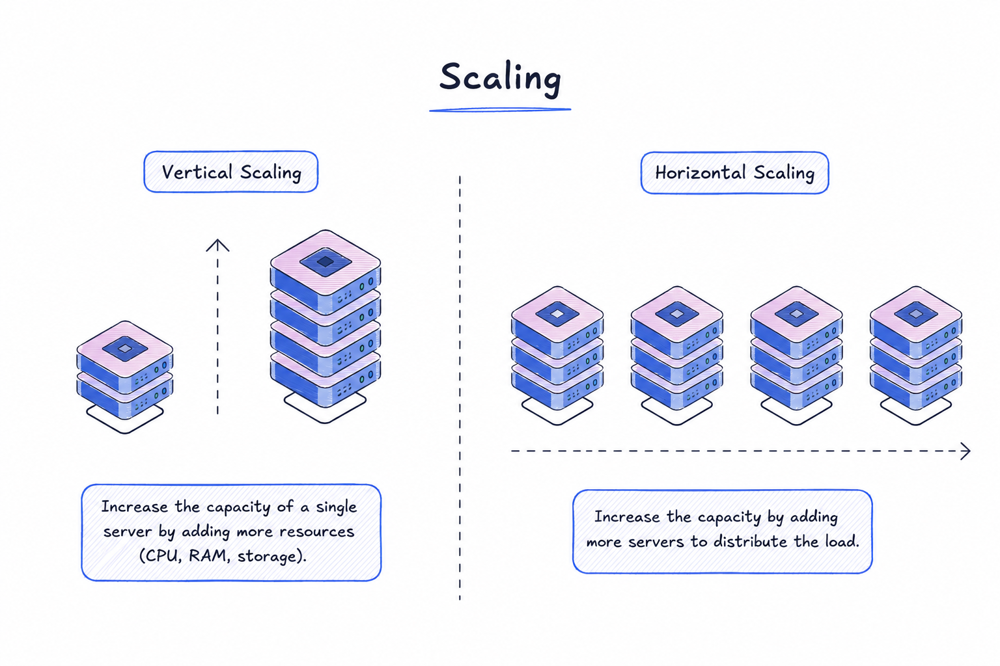

# Scalability

### Programming 101
Imagine you have a computer on which you have written some algorithm, standard program that takes input and gives output. Turns out, your algorithm is very useful. So much that people are even willing to pay for it. But you can't hand over your computer to everyone so you expose your algorithm over the internet. You get input on your machine via **Request** and your machine sends out output via **Response**.

### Self Hosting vs. Cloud
Traditional self-hosting has its limitations. Not just buying hardware but managing it. And situations like power loss, database going down or other such scenarios can be bad for business.
So what should you do then?

You should host your service on **Cloud**. A cloud is nothing but a virtual computer you can access remotely from anywhere across the globe.
**Cloud services like AWS (Most Popular), GCP or Azure provides computation power for money**. Computation power simply means that a set of computer, that these service providers have somewhere physically, that can be accessed via remote-logins. 

### Scalability
Now you have your code running on a machine, processing requests and sending response. This cycle needs computation power, including RAM, storage, CPU cores, etc.  Let's say your system can easily handle upto 10K requests. But what happens, when you get 100K requests or even 1M requests?

You have 2 options:
1. **Buy Bigger Machine** which is known as Vertical Scaling. Larger machine has more computation power and as such, it can handle more requests.
2. **Buy More Machines** which we call Horizontal Scaling. Instead of replacing your machine with bigger ones, you buy more units of same type and distribute your traffic across those machines instead .

   

### Differences between Horizontal Scaling vs. Vertical Scaling

| Horizontal Scaling | Vertical Scaling |
---------------------|-------------------
| Load Balancer is Required | Single Machine to handle all traffic |
| Resilient System | Single Point of Failure | 
| Communication over Network calls (slower) | Inter process communication (faster) | 
| Eventual Consistency | Highly Consistent |
| Scales well as users Increase | Hardware Limitations |

### What to use in Real Life?
Both. We take the good qualities of both and design system on it. Initially you can scale your system vertical as long as its feasible. Then scale horizontally buy adding more machines as users keep increasing.